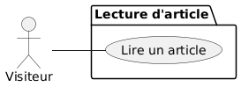
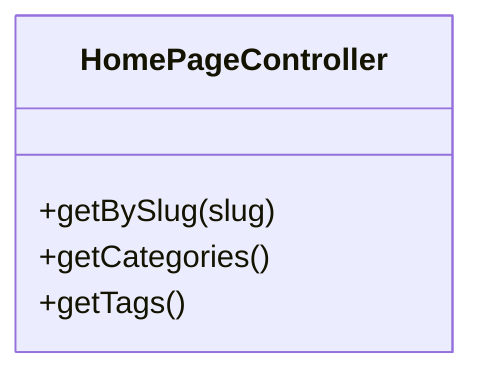
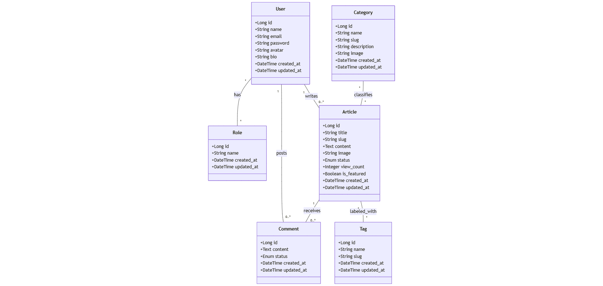
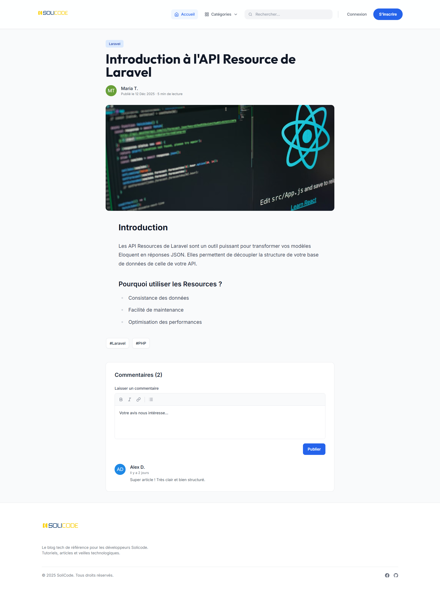

# Blog Solicode
## Sprint 1 : Page Article Details

**Présenté par :** Mohamed Ouallou  
**Encadré par :** Mr. Essarraj Fouad

---

# Introduction

## Travail à faire

Créer la **Page Article Details** du **Blog Solicode**

### Labs :
- PHP Naming Conventions

---

# Livrables Attendus

À la fin de ce sprint :

1. **Code Source**  
   Dépôt Laravel bien structuré

2. **Frontend**  
   Page Article Details fonctionnelle et responsive

3. **Documentation**  
   Présentation du Sprint 1 terminée

---
# Design Thinking

1. **Empathie** : Comprendre besoins.
2. **Définition** : Identifier problèmes.
3. **Ideation** : Brainstorming solutions.
4. **Prototypage** : Maquettes.
5. **Tests** : Validation utilisateurs.

---


---

# UseCase



---

# Fonctionnalités



---

# Class Diagram




---
# Maquette

**Tests** : Avec **Mohamed Yassir El Mesbahi** (apprenant 1ère année).
Retours : Ajout d’un minuteur pour enregistrer le temps de lecture d’un article.



---

# Lab : PHP Naming Conventions
## Variables
- Utiliser le **camelCase**
```php
$userName;
$totalPrice;
```
## Fonctions
```php
function getUserName() {}
function calculateTotal() {}
```
---

## Classes
```php
class UserController {}
class ProductService {}
```
